# 🤖 Titany AI Trading - MONEY BANG BANG (Turbo Version)

🇬🇧 **[English]** | 🇮🇹 **[Italiano]** | 🇪🇸 **[Español]**

---

## 🇬🇧 English

This repository contains the source code to train and run **Titany AI**, a trading bot based on Reinforcement Learning (Recurrent PPO) specialized in EURUSD.

### ⚡ What's New in this Version (V11)
The code has been heavily modified to solve the "Panic Syndrome" the AI was suffering from.
1. **Forced Patience:** Geometric compounding rewards for "trend-surfing" and massive penalties (-15 points) for prematurely closing positions with micro-profits.
2. **Multi-Core Training:** Native support to utilize 100% of the CPU (`SubprocVecEnv`). It automatically detects and uses all available cores.

### 🛠️ Training Instructions (For High-Performance PCs)
If you downloaded this repo to train the model on a powerful computer, follow these steps:

**1. Clone the repository**
```bash
git clone https://github.com/marcogiampaolo2017-afk/Titany-AI-Trading-MONEY-BANG_BANG.git
cd Titany-AI-Trading-MONEY-BANG_BANG
```

**2. Install requirements**
(It is highly recommended to create a virtual environment first: `python -m venv .venv` and activate it).
```bash
pip install -r requirements.txt
```

**3. Start Turbo Training**
Run the training script. The system will automatically detect your CPU cores and spawn multiple parallel environments to massively speed up learning.
```bash
python train_agent.py
```

**4. Extract the Model**
Once the training finishes (it will go through 3 complete phases), the script will automatically generate a file named `best_model.zip` (or similar) inside the `/best_models/` folder.
**Send that .zip file back** to the repo owner so they can plug it into the live bot using `TITANY_AI_Terminal_Pro.py`.

---

## 🇮🇹 Italiano

Questo repository contiene il codice sorgente per addestrare ed eseguire **Titany AI**, un bot di trading basato su Reinforcement Learning (Recurrent PPO) specializzato in EURUSD.

### ⚡ Novità di questa Versione (V11)
Il codice è stato pesantemente modificato per risolvere la "Sindrome da Panico" di cui soffriva l'IA.
1. **Pazienza Forzata:** Ricompense geometriche per "surfare le tendenze" e penalità enormi (-15 punti) per la chiusura prematura di posizioni con micro-profitti.
2. **Addestramento Multi-Core:** Supporto nativo per utilizzare il 100% della CPU (`SubprocVecEnv`). Rileva automaticamente tutti i core disponibili.

### 🛠️ Istruzioni per l'Addestramento (Per PC ad Alte Prestazioni)
Se hai scaricato questo repository per eseguire l'addestramento su un computer potente, segui questi passaggi:

**1. Clona il repository**
```bash
git clone https://github.com/marcogiampaolo2017-afk/Titany-AI-Trading-MONEY-BANG_BANG.git
cd Titany-AI-Trading-MONEY-BANG_BANG
```

**2. Installa i requisiti**
(È consigliabile creare prima un ambiente virtuale con `python -m venv .venv` e attivarlo).
```bash
pip install -r requirements.txt
```

**3. Avvia l'Addestramento Turbo**
Avvia lo script di addestramento. Il sistema dovrebbe rilevare automaticamente i core della tua CPU e avviare più ambienti paralleli per accelerare enormemente l'apprendimento.
```bash
python train_agent.py
```

**4. Estrai il Modello**
Una volta terminato l'addestramento (passerà attraverso 3 fasi complete), lo script genererà automaticamente un file chiamato `best_model.zip` (o simile) all'interno della cartella `/best_models/`. 
**Restituisci quel file .zip** al proprietario del repository in modo che possa collegarlo al bot live usando `TITANY_AI_Terminal_Pro.py`.

---

## 🇪🇸 Español

Este repositorio contiene el código fuente para entrenar y ejecutar a **Titany AI**, un bot de trading basado en Reinforcement Learning (Recurrent PPO) especializado en EURUSD.

### ⚡ Novedades de esta Versión (V11)
El código ha sido fuertemente modificado para resolver el "Síndrome de Pánico" que sufría la IA.
1. **Paciencia Forzada:** Recompensas geométricas por "surfear tendencias" y castigos masivos (-15 puntos) por cerrar posiciones prematuramente con micro-ganancias.
2. **Entrenamiento Multinúcleo:** Soporte nativo para utilizar el 100% de la CPU (`SubprocVecEnv`). Detecta automáticamente todos los núcleos disponibles.

### 🛠️ Instrucciones de Entrenamiento (Para PC de Alto Rendimiento)

Si has descargado este repositorio para ejecutar el entrenamiento en una computadora potente, sigue estos pasos:

**1. Clonar el repositorio**
```bash
git clone https://github.com/marcogiampaolo2017-afk/Titany-AI-Trading-MONEY-BANG_BANG.git
cd Titany-AI-Trading-MONEY-BANG_BANG
```

**2. Instalar los requisitos**
(Es recomendable crear primero un entorno virtual con `python -m venv .venv` y activarlo).
```bash
pip install -r requirements.txt
```

**3. Iniciar el Entrenamiento Turbo**
Arranca el script de entrenamiento. El sistema debería detectar automáticamente los núcleos de tu CPU e iniciar múltiples entornos paralelos para acelerar el aprendizaje masivamente.
```bash
python train_agent.py
```

**4. Extraer el Modelo**
Una vez que termine el entrenamiento (las 3 fases completas por las que pasará), el script generará automáticamente un archivo llamado `best_model.zip` (o similar) dentro de la carpeta `/best_models/`. 
**Devuélvele ese archivo .zip** al dueño del repositorio para que pueda conectarlo al bot en vivo usando `TITANY_AI_Terminal_Pro.py`.

## 🗺️ Mapa de Guerra (Estructura del Proyecto)

Para entender perfectamente cómo funciona Mahoraga (tu bot), aquí tienes la estructura oficial del sistema:

```mermaid
graph TD
    Root["📁 ReinforcementTrading (Proyecto)"]
    
    Executive["🧠 EL GENERAL (Ejecución)"]
    Models["💿 LOS CEREBROS (Modelos AI)"]
    Senses["👀 LOS SENTIDOS (Lógica/Datos)"]
    Memory["📓 LA MEMORIA (Persistencia)"]
    Training["🛠️ LABORATORIO (Entrenamiento)"]
    Reports["📊 ARCHIVOS DE GUERRA (Informes)"]

    Root --> Executive
    Root --> Models
    Root --> Senses
    Root --> Memory
    Root --> Training
    Root --> Reports

    Executive --> T1["TITANY_AI_Terminal_Pro.py<br/>(Tu Bot actual, la UI y el Sniper)"]
    Executive --> T2["live_trading_system.py<br/>(Motor de trading secundario)"]

    Models --> M1["model_eurusd_titany_v12_sniper.zip<br/>(Tu modelo actual de combate)"]
    Models --> M3["vec_normalize.pkl<br/>(El manual de calibración del modelo)"]

    Senses --> S1["indicators.py<br/>(Calcula FER, Z-Score, VSA, etc.)"]
    Senses --> S2["trading_env.py<br/>(Define las reglas del juego para la IA)"]
    Senses --> S3["📁 data/<br/>(Donde se guarda el historial de velas)"]

    Memory --> Mem1["synaptic_memory.json<br/>(Recuerda el peso W de confianza)"]
    Memory --> Mem2["equity_history.json<br/>(Recuerda tu gráfico de la semana)"]
    Memory --> Mem3["lstm_memory_v12.pkl<br/>(Recuerda el estado mental de la IA)"]

    Training --> L1["train_agent.py<br/>(Para crear nuevas IAs desde cero)"]
    Training --> L2["strategy.ipynb<br/>(Libreta para probar nuevas matemáticas)"]

    Reports --> R1["reporte_trades_detalle.csv<br/>(Excel con cada operación histórica)"]
    Reports --> R2["reporte_600k_pasos.png<br/>(Foto del éxito del entrenamiento)"]
```



---
*Powered by Stable-Baselines3, PyTorch & MetaTrader5.*
